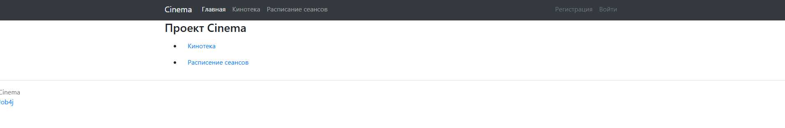
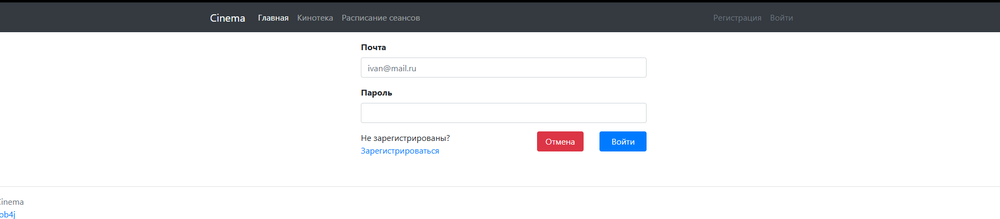
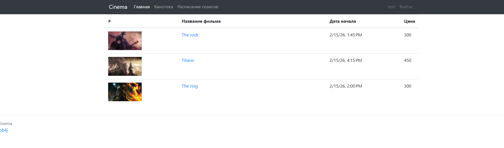
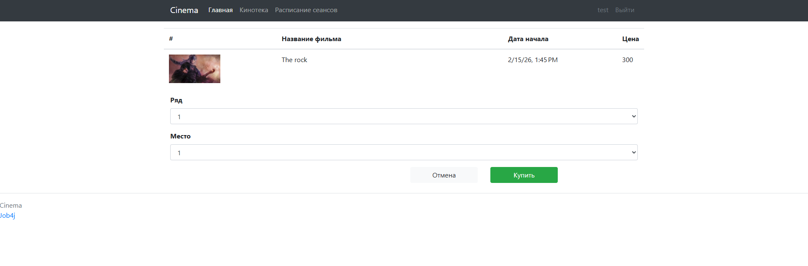

# job4j_cinema
Данный проект направлен на создание упрощенного веб-приложения для кинотеатра.
В приложении есть авторизация, просмотр кинотеки и киносеансов.
Покупка билетов доступна только авторизованным пользователям.

### Стек технологий
>java 21, SpringBoot 3.4, PostgreSQL 18, Maven 3.9.11

### Взаимодействие с приложением

Главная страница

Страница авторизации

Страница регистрации

Страница показа киносеансов

Страница покупки билета
